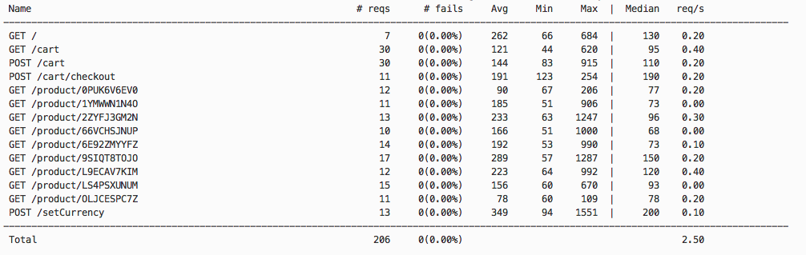
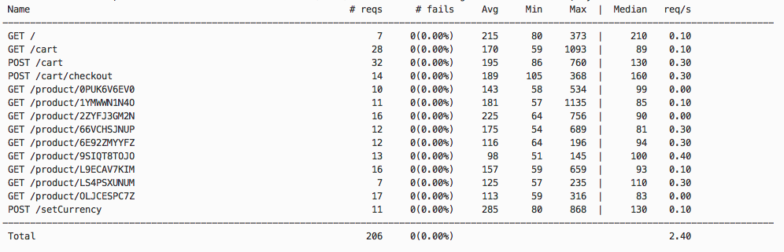

# HW #2

## Design Overview

Used Ambassador API Gateway AuthService to perform authentication. All ambassador related files have prefix <code>ambassador*.yaml</code>. All routes must be authenticated.

## Authentication
User: username

Password: password

## Load Generator Results:
- Before Authentication

- After Authentication

## Results

It seems with 200 requests, there is not much difference between the average, max, and median latencies before and after authentication. This could be due to high CPU load on local laptop during load testing where auth overhead is low compared to volatility of CPU scheduler. 